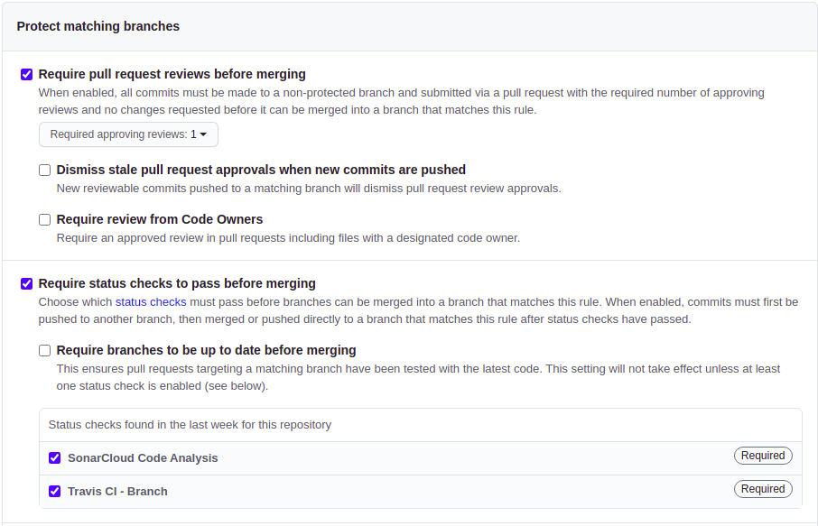
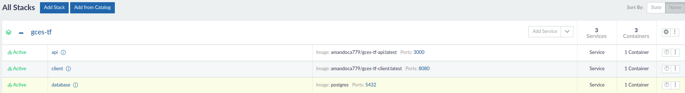
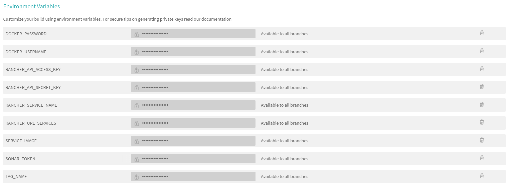

[](https://travis-ci.com/pAmanda/gces-tf-client)
[](https://sonarcloud.io/dashboard?id=pAmanda_gces-tf-client)
[](https://sonarcloud.io/dashboard?id=pAmanda_gces-tf-client)
[](https://sonarcloud.io/dashboard?id=pAmanda_gces-tf-client)
[](https://sonarcloud.io/dashboard?id=pAmanda_gces-tf-client)
[](https://sonarcloud.io/dashboard?id=pAmanda_gces-tf-client)

# Trabalho Final da Disciplina GCES

Esse repositório guarda o código fonte do Client em Vue JS do trabalho final da disciplina **GCES**.

## Como rodar?

* Instale o docker e docker compose em sua máquina.

* Rode os seguintes comandos:

```$ docker-compose build```

```$ docker-compose up```

Após isso, acesse a aplicação na seguinte URL:

http://localhost:8080

## Análise estática

Foi utilizando o SonarCloud para a análise e coleta de métricas do código fonte.

[](https://sonarcloud.io/dashboard?id=pAmanda_gces-tf-client)

## Conteinerização

Para isolar o ambiente, foi utilizado Docker e o Docker compose para a orquestração dos containers.

Criei o Dockerfile para a construção da imagem docker do Front e o docker-compose.yml administra esse container.

## Integração Contínua

Foram utilizados o Travis CI e o Sonar para verificar a qualidade do código.

A **master** foi configurada para não aceitar códigos que não passaram na Integração Contínua.

<p align="center">
  
</p>

## Deploy Automático

O deploy foi feito utilizando 2 Droplets na Digital Ocean, 1 sendo para a instação do Rancher e o outro para o deploy dos containers.

<p align="center">
  
</p>

URL Rancher: http://104.236.2.94:8080/

Os containers da API, do banco de dados e do front-end estão rodando na stack gces-tf.

<p align="center">
  
</p>

URL Front-end: http://104.131.170.181:8080/

Para o deploy automático, foram adicionadas 2 fases no travis, a Docker e o Deploy.

* Fase Docker: cria a imagem e pusha ela para a minha conta pessoal no Docker Hub.

* Fase Deploy: executa um script em python responsável por chamar a api do próprio Rancher para fazer o Upgrade da imagem antiga para a que foi criada na fase anterior. OBS: Usei esse script do trabalho em grupo de GCES (Convinfo).

Para o travis se integrar corretamente com o Docker hub e Ranhcer, foram adicionadas as seguintes variáveis de ambiente:

<p align="center">
  
</p>